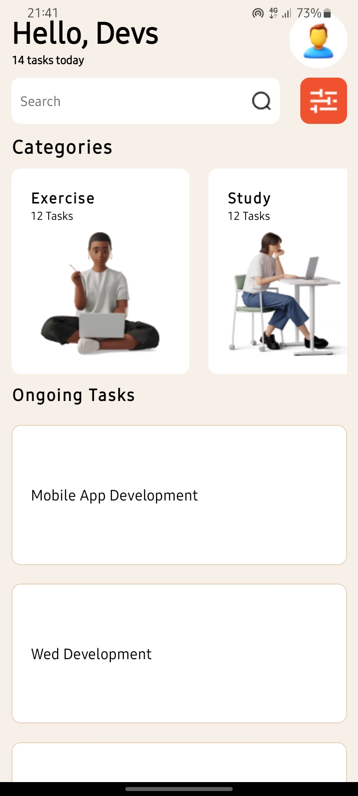
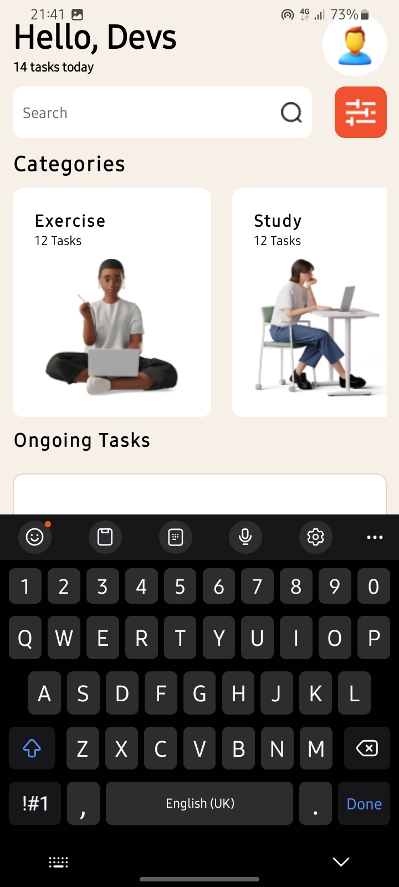

## DCIT202 Assignment 3
# RN Assignment 3 - 11146250

## Description
This is the third assignment for the DCIT202 Mobile Application Development course. The project implements a mobile application based on the provided Figma design.

## Components
1. **Header Component**
   - Displays the greeting message and profile picture.
2. **Search Component**
   - Contains a search input field with an icon.
3. **Categories Component**
   - Shows a horizontal list of categories.
4. **Tasks Component**
   - Displays the ongoing tasks in a vertical list.

## Screenshots

